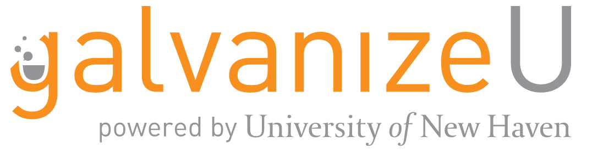

Precourse Materials
====

__Welcome!__

We are excited that you decided to join the Master of Science in Data Science. The next year will be fun (and a lot of work). People come to the program from a variety of backgrounds, we love that diversity but we want everyone to be on the same page on the first day of classes. We have designed this Precourse to help you learn some of the technical skills that you will need to succeed in the program.

> "I wish I did more precourse stuff."    

\- Every Data Science Masters student

Please skim all of the materials before getting started on the individual lessons.

You are expected read each lesson, complete the assignments, and turn them in. Please complete and hand-in each lesson sequentially.
